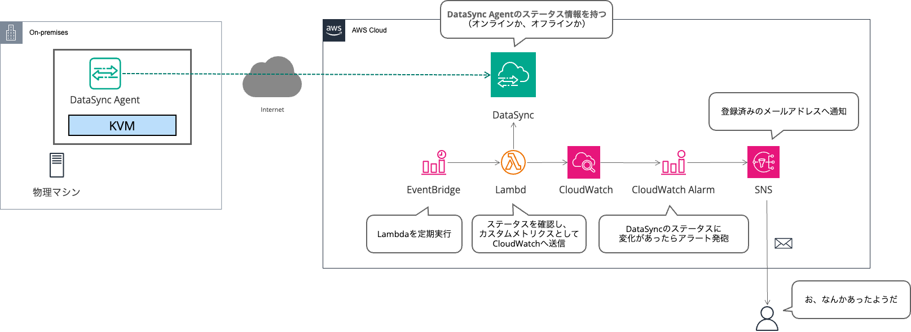

# AWS DataSync エージェントのステータスモニタリング

このプロジェクトは、AWS Lambda と CloudWatch を使用して AWS DataSync エージェントの自動監視ソリューションを提供します。DataSync エージェントの状態を継続的に監視し、エージェントがオフラインになった際に通知を発信することを目的とします。

このソリューションは、DataSync エージェントの状態を1時間ごとにチェックし、カスタムメトリクスを CloudWatch に公開するサーバーレスアーキテクチャを展開します。エージェントが利用できなくなると、システムは CloudWatch アラームをトリガーし SNS を通じてメール通知します。

## リポジトリ構造
```
.
├── events/
│   └── event.json              # Lambda 関数テストイベントテンプレート
├── src/
│   └── app.py                  # エージェント状態監視用の Lambda 関数
├── template.yaml               # AWS インフラストラクチャを定義する SAM テンプレート
└── requirements.txt            # Python 依存関係
```

## 使用方法
### 前提条件
- AWS CLI がインストールされ、適切な認証情報で設定されていること
- AWS SAM CLI がインストールされていること
- Python 3.12 がインストールされていること
- 環境内に既存の AWS DataSync エージェントが展開されていること

### インストール
1. リポジトリのクローン
```bash
git clone <リポジトリURL>
cd datasync-agent-monitor
```

2. 依存関係のインストール
```bash
pip install -r requirements.txt
```

3. SAM を使用したデプロイ
```bash
sam build
sam deploy --guided
```

### クイックスタート
1. デプロイ時に、DataSync エージェント ARN の入力を求められます。既存の DataSync エージェントの ARN を確認して入力してください。

```bash
DataSyncAgentArn=arn:aws:datasync:リージョン:アカウント:agent/エージェントID
```

2. デプロイ後、SNS トピック（`DataSyncAgentStatusNotification`）に通知先のメールアドレスを登録し、サブスクライブを行ってください。

## データフロー
AWS DataSync からエージェントのステータスをポーリングし、アラーム評価のためにカスタムメトリクスを CloudWatch に送ります。



## インフラストラクチャ
### Lambda
- DataSyncAgentStatusFunction (Python 3.12, arm64)
  - メモリ：128MB
  - タイムアウト：120秒
  - 実行スケジュール：1時間ごと

### CloudWatch
- DataSyncAgentOfflineAlarm
  - DataSyncAgentStatus メトリクスを評価
  - 2時間の評価期間
  - ステータス ≤ 0 でトリガー

### SNS
- DataSyncAgentStatusNotification トピック
  - アラーム状態の変更を通知
  - アラームと復旧通知の両方対応